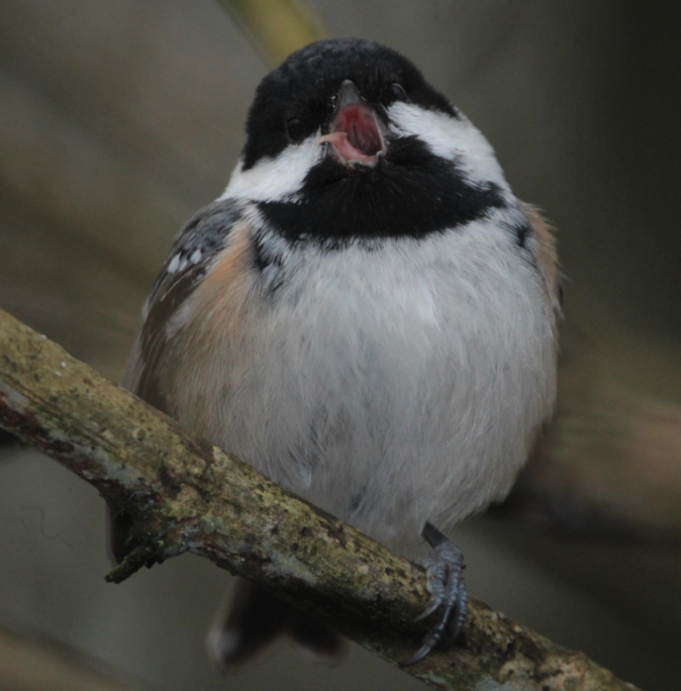

# Bird Migration

## Why are you doing this, Kayla 

## Ha ha, ok, but really

The purpose of this exercise is ultimately to create a proof of concept demonstrating how to capture meaningful metrics via GCP Logging.

If I post to an API, and that post kicks off a series of events involving various pubsub messages and streaming pipelines, I want to know how much time it takes the object to travel through each step.

I want to track the status of the data (bird) as it travels through my code (migrates from the northeast to the southeast). 

I want to be able to get an idea of how long it takes on average, so that I can reliably report out the level of service I am providing (I guess that makes me a jetstream in this metaphor? I'm losing the thread)

tl;dr - I want to demonstrate how to provide meaningful logs for a multifaceted streaming system. 

## Summary of events

1. Someone posts a JSON object representing a bird to an api endpoint: `{"name": "chickadee"}`
2. The endpoint:
    - Adds a `start_time` & `uuid` to the bird object `{"name": "chickadee", "start_time": <utc-string>, "uuid": <some-random-string>}`
    - Publishes the bird object to GCP PubSub Topic (`take_flight`)
3. A GCP cloud function listening to the topic:
    - takes in the bird object
    - fetches an image of the bird from an external api (unsplash)
    - creates a new bird object `{"name": "chickadee", "image": "https://www.coolbirds.com/some-chickadee-image.png"}`
    - publishes the new bird object to a different pubsub topic  (`start_migration`)
4. An Apache Beam streaming pipeline running on GCP dataflow, which represents the bird travelling through the North East, called the `NorthEastPipeline`:
    - uses `take_flight` pubsub topic as a data source
    - for each bird that comes through the pipeline:
        - add a `ne_arrival` timestamp to the bird object
        - use an external API to grab the air quality of a random city in the North East region 
        - create an array on each bird object called `air_quality` and append this air quality observation to the bird, `{...birdObject, "ne_arrival": <utc-string>, air_quality: [{...observation object for Boston, MA}]}`
        - Publish the updated bird object to a new Pubsub topic, `depart_ne`
5. An Apache Beam streaming pipeline running on GCP dataflow, which represents the bird travelling through the Mid Altantic, called the `MidAtlanticPipeline`:
    - uses `depart_ne` pubsub topic as a data source
    - for each bird that comes through the pipeline, 
        - use an external API to grab the air quality of a random city in the Mid Altantic 
        - add a `ma_arrival` timestamp to the bird object
        - append this air quality observation to the bird's `air_quality` array, `{...birdObject, "ma_arrival": <utc-string>, air_quality: [{...observation object for Boston, MA}, {...observation object for Richmond, VA}]}`
        - Publish the updated bird object to a new Pubsub topic, `depart_ma`    
6. An Apache Beam streaming pipeline running on GCP dataflow, which represents the bird travelling through the South East, called the `SouthEastPipeline`:
    - uses `depart_ma` pubsub topic as a data source
    - for each bird that comes through the pipeline, 
        - use an external API to grab the air quality of a random city in the South East
        - add a `se_arrival` timestamp to the bird object
        - append this air quality observation to the bird's `air_quality` array, `{...birdObject, "se_arrival": <utc-string>, air_quality: [{...observation object for Boston, MA}, {...observation object for Richmond, VA}, {...observation object for Charleston, SC}]}`
        - Write the completed bird object to a GCS bucket (`arrival_bucket`)    
7. The GCS bucket emits notifications to a pubsub topic (`arrival`) when a new object is added to the bucket
8. A React app subscribes to the `arrival` pubsub topic, and displays info about each bird as it arrives.
  

## Summary of Dev Tasks

- Write terraform for GCP resources, specifically:
    - Pubsub 
    - Storage 
    - Cloud Functions
    - Dataflow (WIP)
- Writing a cloud function that is:
    - Triggered by a pub sub
    - Makes an API call to enrich the incoming data (a JSON object representing a bird) with an image from unsplash
    - Publishes the enriched data to a different pubsub topic
- Write a small express app to:
    - create an endpoint that takes in a JSON object representing a bird
    - Give the JSON object a timestamp and a unique ID
    - Publish that JSON object to a pubsub topic    
    
WIP: 
- Writing Apache Beam pipelines to:
    - Stream unbounded data sets
    - Read from pub subs
    - Write to pub subs, or a GCS bucket
- Write a small react app that:
    - Subscribes to a pubsub topic
    - Displays messages received from the pubsub topic
    - Can access the express app from the above step to start the chain of events
- Incorporate GCP logging throughout to:
    - Keep track of the status of each bird object as it travels through each pipeline/pubsub/bucket
    - Collect analytics around how long it takes each bird to get from start to finish (the goal being that we can write SLO's around these numbers) 
